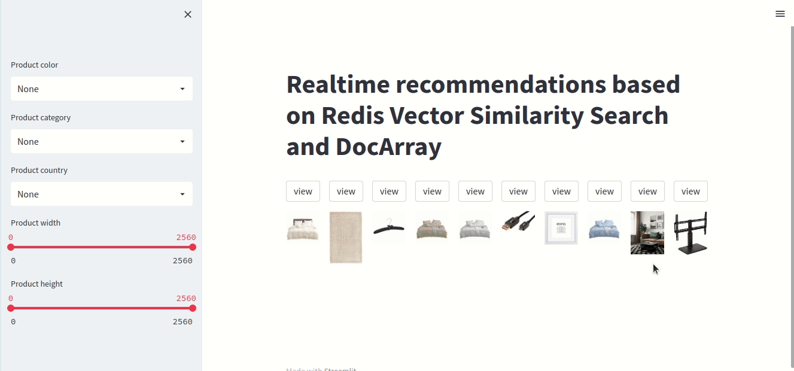

# Real-time product recommendation using Redis and DocArray
This project is a demo of real-time product recommendation using Redis and DocArray.
This real-time recommendation relies on VSS to recommend visually similar products that satisfy a set of user filters.
Recommendations are based on user session data which consists of weighted average of the last k visited products.

## about the dataset:
The dataset is derived from the "[Amazon Berkeley Objects Dataset](https://amazon-berkeley-objects.s3.amazonaws.com/index.html)".
It comes in a DocArray format from Jina Cloud available using the following keys:
- 'amazon-berkeley-objects-dataset': pre-processed subset of the Amazon Berkeley Objects Dataset in DocArray format.
- 'amazon-berkeley-objects-dataset-encoded': encoded version of `'amazon-berkeley-objects-dataset'` using [CLIP-as-service](https://clip-as-service.jina.ai)
 to encode images.

This project uses `amazon-berkeley-objects-dataset-encoded` by default. If you want to use different embeddings (for 
instance, by encoding mesh data):
1. Pull the dataset from Jina Cloud: `da = DocumentArray.pull('amazon-berkeley-objects-dataset')`
2. Encode the data using any model of your choice
3. Push the dataset to the Cloud: `da.push('my-da-name')`
4. Set the `DATASET_NAME` environment variable before running the application: `export DATASET_NAME=my-da-name`

## Run the application:
In order to run the application, make sure to follow these steps:
1. Make sure to have a running Redis instance with at least RediSearch 2.4 module installed. You can do so using Docker:
`docker run -d -p 6379:6379 redislabs/redisearch:2.6.0`
Alternatively, you can create an instance for free on [Redis Cloud](https://redis.com/try-free/).

PS: if you have used a cloud instance, make sure to update the Redis credentials (host, port and password) in `utils.py`.
2. Install dependencies: `pip install -r requirements.txt`
3. Login to Jina Cloud: `jina auth login`
4. Run the streamlit application: `streamlit run main.py`

## Demo
